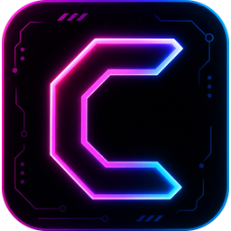

<p align="center">
  
</p>

<h1 align="center">CyberLauncher</h1>

<p align="center">
  <strong>A cyberpunk-themed desktop application launcher for Windows</strong>
</p>

<p align="center">
  
  
  
  
</p>

---

## Overview

CyberLauncher is a full-screen, glassmorphic application launcher built with **Electron + React + TypeScript**. Designed to replace the traditional Windows Start Menu, it provides a fast, keyboard-driven workflow to organize, search, and launch your apps — all wrapped in a sleek cyberpunk interface.

## Features

- **⚡ Instant Launch** — Open any app, shortcut (.lnk), or URL with a single click or keyboard shortcut
- **⭐ Favorites & Drag-to-Reorder** — Pin your most-used apps to a favorites bar with drag & drop reordering
- **🔍 Fuzzy Search** — Start typing to instantly filter your app library
- **📂 Custom Categories** — Organize apps into color-coded categories with inline editing
- **🖥️ Multi-Monitor Support** — Choose which display CyberLauncher appears on
- **🎯 Hot Corners** — Activate the launcher by moving your cursor to any screen corner
- **⌨️ Global Shortcut** — Show/hide with a customizable keyboard shortcut (default: `Alt+Space`)
- **🎨 Theming** — Background images, gradients, solid colors, glass intensity, and opacity controls
- **📊 System Monitor** — Real-time RAM usage and disk space in the top bar
- **🔒 Single Instance** — Only one instance runs at a time; second launches focus the existing window
- **👻 Auto-Hide on Blur** — Launcher hides automatically when you switch to another window
- **📥 Drag & Drop from Explorer** — Drag `.exe` or `.lnk` files directly into the launcher to add them
- **🔄 Config Sync** — Centralized JSON config shared between dev and production environments
- **💾 Export / Import** — Backup and restore your entire configuration as JSON
- **🖱️ Resizable Panels** — Drag to resize the category sidebar and most-used panel
- **📌 Taskbar** — A customizable bottom bar with pinned apps

## Screenshots

> _Coming soon_

## Getting Started

### Prerequisites

- [Node.js](https://nodejs.org/) v18+
- [Git](https://git-scm.com/)

### Development

```bash
# Clone the repository
git clone https://github.com/Ciber-CR/CyberLauncher.git
cd CyberLauncher

# Install dependencies
npm install

# Run in development mode (Electron + Vite HMR)
npm run dev
```

### Build for Production

```bash
# Build the app and create the Windows installer
npm run build
npx electron-builder --win

# The installer will be in the release/ directory
```

## Tech Stack

| Layer       | Technology                              |
|-------------|----------------------------------------|
| Framework   | Electron 42                            |
| Frontend    | React 19, TypeScript                   |
| Bundler     | Vite 6                                 |
| Styling     | Tailwind CSS 4                         |
| Animations  | Motion (Framer Motion)                 |
| Icons       | Lucide React                           |
| Installer   | electron-builder (NSIS)                |

## Project Structure

```
CyberLauncher/
├── electron/
│   ├── main.ts          # Electron main process
│   └── preload.ts       # Context bridge (IPC API)
├── src/
│   ├── App.tsx           # Main React application
│   ├── main.tsx          # React entry point
│   └── index.css         # Global styles
├── public/               # Static assets & icons
├── package.json
├── vite.config.ts
└── tsconfig.json
```

## Configuration

CyberLauncher stores its configuration in:

```
%APPDATA%/CyberLauncher/cyber-launcher-config.json
```

This file is the single source of truth, shared between development and production builds. It includes apps, categories, favorites, taskbar pins, theme settings, shortcuts, and hotspot configuration.

## License

MIT © [Ciber-CR](https://github.com/Ciber-CR)
