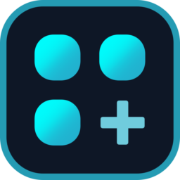

<p align="center">
  
</p>

<h1 align="center">CyberLauncher</h1>

<p align="center">
  <strong>A cyberpunk-themed desktop application launcher for Windows</strong>
</p>

<p align="center">
  
  
  
  
</p>

---

## Overview

CyberLauncher is a full-screen, glassmorphic application launcher built with **Electron + React + TypeScript**. Designed to replace the traditional Windows Start Menu, it provides a fast, keyboard-driven workflow to organize, search, and launch your apps — all wrapped in a sleek cyberpunk interface. Available in **English and Spanish**.

*Free and open source (GPLv3) — no ads, no tracking, and no data collection. Just enjoy it.*

## Features

- **⚡ Instant Launch** — Open any app, shortcut (.lnk), or URL with a single click or keyboard shortcut
- **⭐ Favorites & Drag-to-Reorder** — Pin your most-used apps to a favorites bar with drag & drop reordering
- **🔍 Fuzzy Search** — Start typing to instantly filter your app library
- **🗂️ System-Wide File Search** — Hybrid indexing engine with Everything-grade speed to find files, folders, and apps across all drives
- **🛍️ UWP / Windows Store Support** — Natively scan, import, and launch UWP & MSIX apps via AUMID
- **📂 Custom Categories** — Organize apps into color-coded categories with inline editing
- **🖥️ Multi-Monitor Support** — Choose which display CyberLauncher appears on
- **🎯 Hot Corners** — Activate the launcher by moving your cursor to any screen corner
- **⌨️ Global Shortcut** — Show/hide with a customizable keyboard shortcut (default: `Alt+Shift+L`)
- **🎨 Theming** — Background images, gradients, solid colors, glass intensity, and opacity controls
- **📊 System Monitor** — Real-time RAM, CPU, and disk usage in the top bar
- **💾 Storage HUD** — View free space and status of all system drives
- **⏱️ Execution Scheduler** — Schedule app launches or console commands with a countdown timer
- **📜 Execution History** — Track and reopen everything you've launched, with clear-history option
- **🔒 Single Instance** — Only one instance runs at a time; second launches focus the existing window
- **👻 Auto-Hide on Blur** — Launcher hides automatically when you switch to another window
- **📥 Drag & Drop from Explorer** — Drag `.exe` or `.lnk` files directly into the launcher to add them
- **🔄 Auto-Updates** — Automatic update checks and downloads via GitHub releases
- **🔐 Run as Administrator** — Per-app option to request elevated privileges on launch
- **⌨️ Per-App Global Shortcuts** — Assign custom hotkeys to launch any app from anywhere
- **🌐 Bilingual UI** — Full English and Spanish interface with language switcher
- **💾 Export / Import** — Backup and restore your entire configuration as JSON
- **🖱️ Resizable Panels** — Drag to resize the category sidebar and most-used panel
- **📌 Taskbar** — A customizable bottom bar with pinned apps
- **🚀 Launch with Windows** — Optionally start minimized or visible at system boot

## Screenshots

> _Coming soon_

## Getting Started

### Prerequisites

- [Node.js](https://nodejs.org/) v18+
- [Git](https://git-scm.com/)

### Development

```bash
# Clone the repository
git clone https://github.com/CyberGems/CyberLauncher.git
cd CyberLauncher

# Install dependencies
npm install

# Run in development mode (Electron + Vite HMR)
npm run dev
```

### Build for Production

```bash
# Build the app and create the Windows installer
npm run build:electron

# The installer will be in the release/ directory
```

### Lint

```bash
# Type-check the project
npm run lint
```

## Tech Stack

| Layer       | Technology                              |
|-------------|----------------------------------------|
| Framework   | Electron 42                            |
| Frontend    | React 19, TypeScript                   |
| Bundler     | Vite 6                                 |
| Styling     | Tailwind CSS 4                         |
| Animations  | Motion (Framer Motion)                 |
| Icons       | Lucide React                           |
| Installer   | electron-builder (NSIS)                |
| Updater     | electron-updater (GitHub releases)     |

## Project Structure

```
CyberLauncher/
├── electron/
│   ├── main.ts            # Electron main process
│   ├── preload.ts         # Context bridge (IPC API)
│   ├── display-resolve.ts # Multi-monitor display logic
│   └── updater.ts         # Auto-update (electron-updater)
├── scripts/
│   └── generate-icons.mjs # Icon generation pipeline
├── src/
│   ├── App.tsx            # Main React application
│   ├── main.tsx           # React entry point
│   ├── index.css          # Global styles
│   ├── locales.ts         # i18n (English / Spanish)
│   ├── AboutModal.tsx     # About & update dialog
│   └── Tooltip.tsx        # Reusable tooltip component
├── public/                # Static assets & icons
├── package.json
├── vite.config.ts
└── tsconfig.json
```

## Configuration

CyberLauncher stores its configuration in:

```
%APPDATA%/CyberLauncher/cyber-launcher-config.json
```

This file is the single source of truth, shared between development and production builds. It includes apps, categories, favorites, taskbar pins, theme settings, shortcuts, indexer configuration, and scheduler tasks.

## Contributing

Contributions are welcome! Please feel free to fork the repository and submit a pull request. For major changes, open an issue first to discuss what you'd like to change.

1. Fork the repository
2. Create your feature branch (`git checkout -b feature/amazing-feature`)
3. Commit your changes (`git commit -m 'Add amazing feature'`)
4. Push to the branch (`git push origin feature/amazing-feature`)
5. Open a Pull Request

## Donate

**CyberLauncher** is a personal open-source project within the **CyberGems** suite. I've spent thousands of hours building and refining it — both for my own use and to share premium-quality software with the world for free.

If you'd like to support this work, a donation would mean a lot. Thank you! 🙏

[](https://paypal.me/CyberGems) [](https://buymeacoffee.com/cybergems)

## License

This project is licensed under the GNU General Public License v3.0. See the [LICENSE](./LICENSE) file for details.

Copyright (C) 2026 CyberGems
